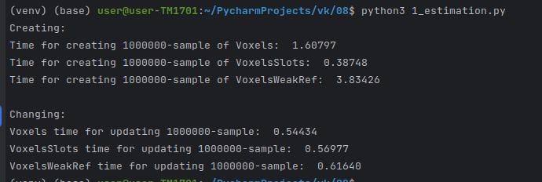
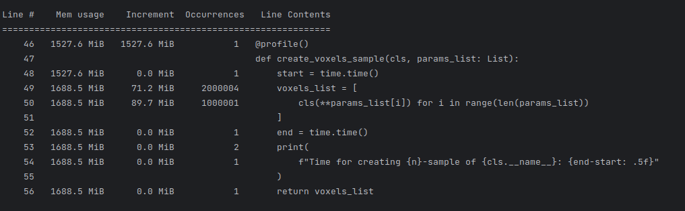
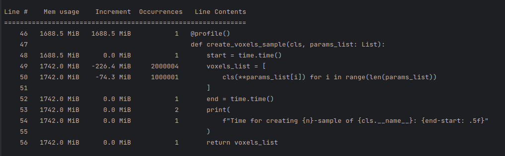
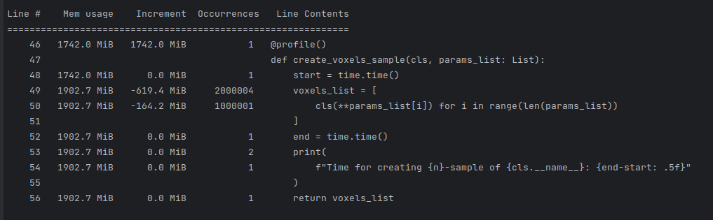
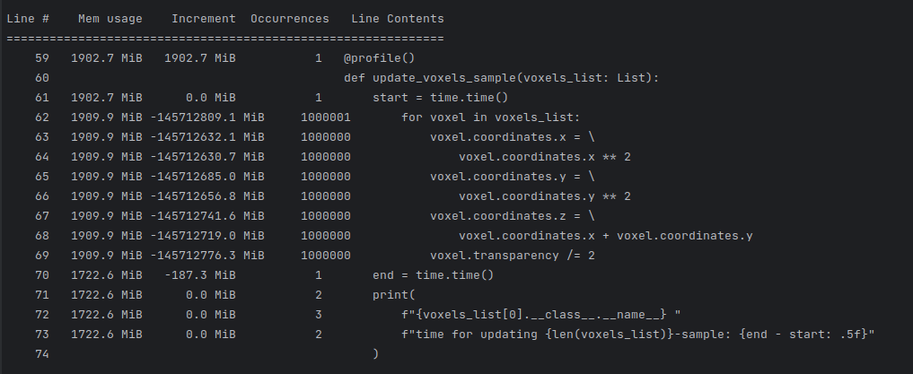
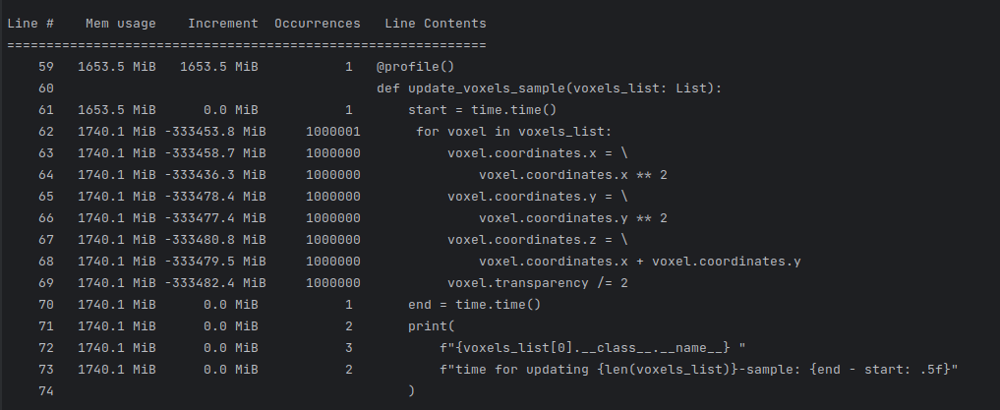

# Отчет

## 1. Сравнение использования weakref и слотов

> Время создания пачки экземпляров, время чтения/изменения атрибутов

    

Исходя из времени работы на 1 млн экземпляров, видно, что их создание
наиболее быстрое у слотовой структуры, наиболее медленное у слабых ссылок.

Изменение атрибутов экземпляров отличается незначительно, но тенденция аналогичная,
медленее всего работают слабые ссылки. 

## 2. Профилирование

> Провести профилирование вызовов и памяти для кода из пункта 1.

  
Создание объектов

    Создание Voxels (прирост памяти в результате выполнения - 161 Мб):
    

        
    

    Создание VoxelsSlots (прирост памяти в результате выполнения - 53 Мб):
    

        
    

    Создание VoxelsWeakRed (прирост памяти в результате выполнения - 160 Мб):
    

        
    

    В данном профилировании видна наиболее эффективная работа с памятью 
    у слотовой структуры, что, в принципе, ожидаемо, так как мы заранее
    задаем необходимые поля. 

  
Изменение объектов

    Изменение Voxels (занятое количество памяти упало на 180 Мб):    
    

        
    

    Изменение VoxelsSlots (занятое количество памяти упало на 70 Мб):
    

        
    

    Изменение VoxelsWeakRed (занятое количество памяти возрасло на 87 Мб):
    

        
    

    Изменение аттрибутов у классической структуры привело к большему снижению памяти,
    однако, слотовая структура все равно выглядит эффективнее, т.к. 
    изначально затрагивала меньше памяти, соответственно и меньше может освободить.

